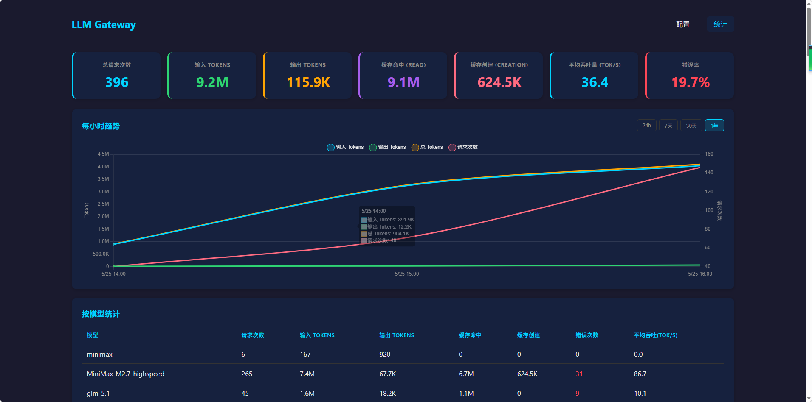
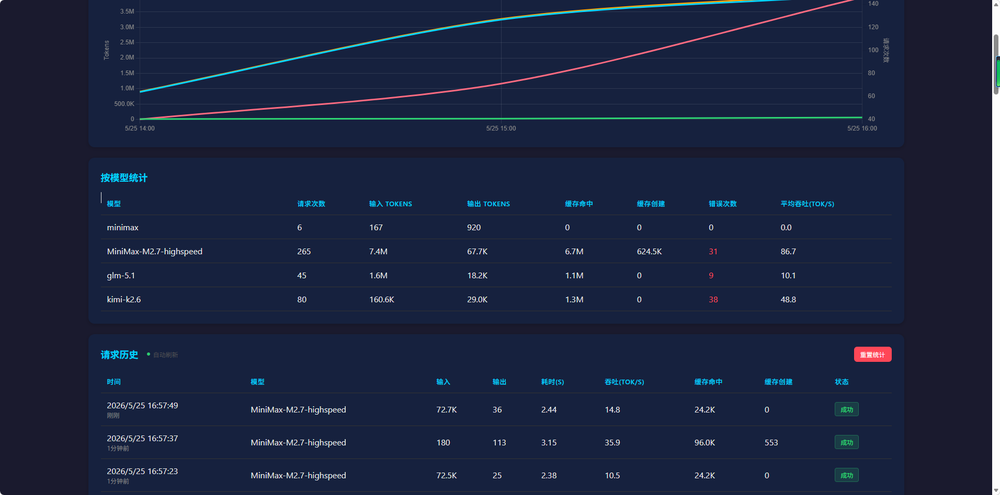
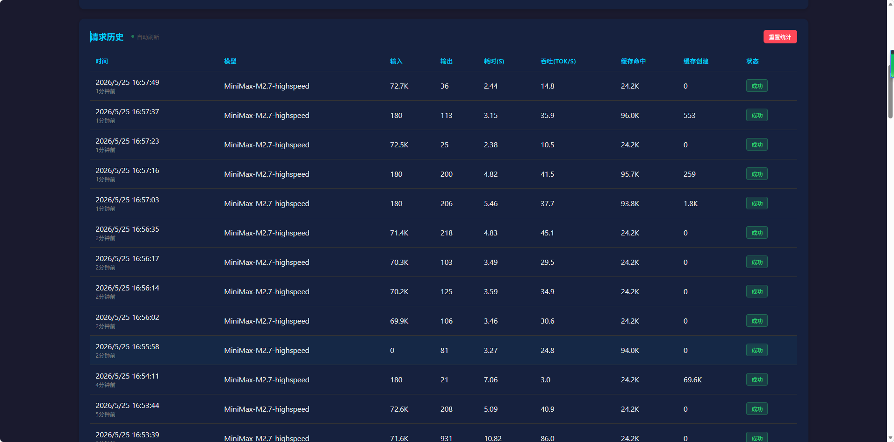

# Mini LLM Gateway

一个轻量的 LLM API 代理网关，支持多模型管理、请求转发和用量统计。

## 功能

- **多模型管理** — 添加、编辑、删除上游模型配置，支持启用/禁用和设置默认模型，可自定义提供商名称
- **费用计算** — 为每个模型配置输入/输出/缓存命中单价，统计表自动计算费用，支持按模型和汇总查看
- **请求转发** — 将 Claude API 格式的请求转发到不同的上游 Provider（MiniMax、DeepSeek 等）
- **SSE 流式响应** — 支持 `text/event-stream` 流式输出
- **用量统计** — 记录每个请求的输入/输出 Tokens、缓存命中、耗时和吞吐，支持按小时聚合查看趋势
- **Dashboard** — Web UI 查看统计面板和请求历史，支持深色/浅色主题切换

## 快速启动

```bash
pip install -e .
mini-llm-gateway
```

服务启动后访问：
- 配置页面：http://localhost:8080/
- 统计面板：http://localhost:8080/dashboard

## 界面预览

**配置页面**



**统计面板**



**每小时趋势**



## 配置文件

`config.yaml` 中的 `allow_origins` 需包含前端页面的 origin，否则 CORS 会拦截请求。

## API 接口

### 代理接口

```
POST /anthropic/v1/messages
HEAD /anthropic
POST /anthropic/v1/messages/count_tokens?beta=true
```

将请求转发至配置的 upstream URL。支持流式响应（`text/event-stream`）。

### 管理接口（仅本地访问）

```
GET    /v1/admin/config           — 获取当前配置和模型列表
POST   /v1/admin/config/models    — 添加模型（含 input_price / output_price / cache_read_price）
PUT    /v1/admin/config/models/{id}     — 更新模型（含价格字段）
DELETE /v1/admin/config/models/{id}     — 删除模型
PUT    /v1/admin/config/models/{id}/enable?enabled=true  — 启用/禁用模型
PUT    /v1/admin/config/active   — 设置默认模型

GET    /v1/admin/stats           — 获取统计数据（summary / by_model 含价格 / history）
GET    /v1/admin/stats/hourly?hours=24   — 按小时聚合的统计数据
POST   /v1/admin/stats/reset     — 重置所有统计数据
```

### 模型定价

每个模型可配置以下价格字段（单位：元/1M tokens）：

| 字段 | 说明 |
|------|------|
| `input_price` | 输入单价（缓存未命中） |
| `output_price` | 输出单价 |
| `cache_read_price` | 输入单价（缓存命中） |

费用计算公式：`费用 = input_tokens/1M × input_price + output_tokens/1M × output_price + cache_read_tokens/1M × cache_read_price`

## 数据存储

- `data/models.json` — 模型配置
- `data/stats.json` — 统计数据（累计 summary + 按模型统计 + 请求历史）

## 目录结构

```
gateway/
├── main.py          — FastAPI 入口
├── config.py        — 配置文件加载
├── api/
│   ├── proxy.py     — 代理转发（/anthropic/*）
│   ├── models.py    — 模型 CRUD API
│   └── admin.py     — 管理 API
├── models/
│   └── manager.py   — 模型管理器（单例）
├── stats/
│   └── collector.py — 统计收集器（单例）
└── web/
    └── router.py    — 静态文件路由

static/
├── index.html       — 配置页面
├── dashboard.html   — 统计面板
└── style.css        — 样式

run.py               — 启动脚本
config.yaml          — 服务配置
```
